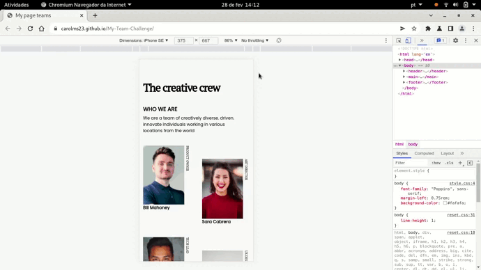

<!-- Please update value in the {}  -->

<h1 align="center">Team Page</h1>

   Solution for a challenge from  <a href="http://devchallenges.io" target="_blank">Devchallenges.io</a>.

  <h3>
    <a href="https://github.com/carolms23/My-Team-Challenge">
      Demo
    </a>
     | 
    <a href="https://carolms23.github.io/My-Team-Challenge/">
      Solution
    </a>
     | 
    <a href="https://devchallenges.io/challenges/hhmesazsqgKXrTkYkt0U">
      Challenge
    </a>
  </h3>

<!-- TABLE OF CONTENTS -->

## Table of Contents

- [Overview](#overview)
  - [Built With](#built-with)
- [Features](#features)
- [Contact](#contact)
- [Acknowledgements](#acknowledgements)

<!-- OVERVIEW -->

## Overview

The page for project is hosted on GitHub Pages: [My-team-Challenge](https://carolms23.github.io/My-Team-Challenge/)

For project I used only HTML and CSS, mainly with properties that helps responsiveness, such as Grid and Flexbox.

I've learned more about using figcaption rotate and writing-mode CSS. :)

### Built With

<!-- This section should list any major frameworks that you built your project using. Here are a few examples.-->

- [HTML](https://developer.mozilla.org/en-US/docs/Web/HTML)
- [CSS](https://www.w3.org/Style/CSS/Overview.en.html)

## Features

This application/site was created as a submission to a [DevChallenges](https://devchallenges.io/challenges) challenge. The [challenge](https://devchallenges.io/challenges/hhmesazsqgKXrTkYkt0U) was to build an application to complete the given user stories.

## Acknowledgements

- [Writing-mode](https://developer.mozilla.org/en-US/docs/Web/CSS/writing-mode)

## Contact

- Website [My-team-Challenge](https://carolms23.github.io/My-Team-Challenge/)
- GitHub [@github.com/carolms23](https://github.com/carolms23/)

